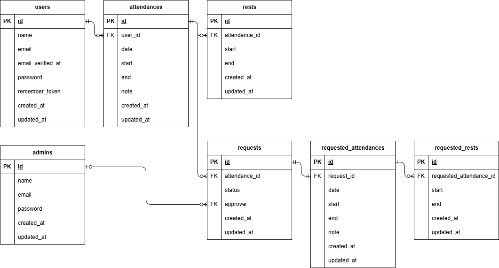

## アプリケーション名

coachtech 勤怠管理アプリ

> [!IMPORTANT]
> クライアントと協議の結果、下記の仕様となっております。
>
> 1. 一覧表示画面について、退勤記録のある日に限り、詳細ボタンが押下できる仕様となっております。
> 2. 勤怠修正機能について、退勤記録のある日に限り、修正できる仕様となっております。

## 環境構築

### Docker ビルド

1.  `git clone git@github.com:kasahara-dev/kasahara-mogi2.git`
2.  `cd kasahara-mogi2`
3.  `docker-compose up -d --build`

> [!IMPORTANT]
> MySQL は、OS によって起動しない場合があるのでそれぞれの PC に合わせて docker-compose.yml ファイルを編集

### Laravel 環境構築

1. `docker compose exec php bash`
2. `composer install`
3. `php artisan key:generate`
4. `php artisan migrate`
5. `php artisan db:seed`
6. `php artisan storage:link`

> [!IMPORTANT]
> "The stream or file could not be opened"エラーが発生した場合
> src ディレクトリにある storage ディレクトリに権限を設定
> `chmod -R 777 storage`

## テスト手順

1. `docker compose exec mysql bash`
2. `mysql -u root -p`
3. `root`
4. `CREATE DATABASE demo_test;`
5. `exit`
6. `exit`
7. .env ファイルから.env.testing を作成し、各環境変数を下記に変更

- `APP_ENV=test`
- `APP_KEY=`
- `DB_DATABASE=demo_test`
- `DB_USERNAME=root`
- `DB_PASSWORD=root`

8. .env ファイルから.env.dusk.local を作成し、各環境変数を下記に変更

- `APP_ENV=testing`
- `APP_URL=http://nginx`

9. `docker compose exec php bash`
10. `php artisan key:generate --env=testing`
11. `php artisan config:clear`
12. `php artisan migrate --env=testing`
13. `composer require --dev laravel/dusk`
14. `php artisan dusk:install`
15. `php artisan dusk:make LoginTest`
16. `php artisan test`
17. `php artisan dusk`

## 使用技術

- PHP 8.1.33
- Laravel 8.83.29
- MySQL 8.0.26

## テーブル仕様

users テーブル

| カラム名          | 型              | primary key | unique key | not null | foreign key |
| ----------------- | --------------- | ----------- | ---------- | -------- | ----------- |
| id                | unsigned bigint | 〇          |            | 〇       |             |
| name              | string          |             |            | 〇       |             |
| email             | string          |             | 〇         | 〇       |             |
| email_verified_at | timestamp       |             |            |          |             |
| password          | string          |             |            | 〇       |             |
| remember_token    | string          |             |            |          |             |
| created_at        | timestamp       |             |            |          |             |
| updated_at        | timestamp       |             |            |          |             |

admins テーブル

| カラム名   | 型              | primary key | unique key | not null | foreign key |
| ---------- | --------------- | ----------- | ---------- | -------- | ----------- |
| id         | unsigned bigint | 〇          |            | 〇       |             |
| email      | string          |             | 〇         | 〇       |             |
| password   | string          |             |            | 〇       |             |
| created_at | timestamp       |             |            |          |             |
| updated_at | timestamp       |             |            |          |             |

## ER 図

## URL

- スタッフログインページ：http://localhost/login
- 管理者ログインページ:http://localhost/admin/login

## テストユーザー

- テストユーザー 1(スタッフ)メールアドレス：`test1@example.com` パスワード：`password`
- 管理者メールアドレス：`admin@example.com` パスワード：`password`

> [!IMPORTANT]
> テストデータでは、すでに複数ユーザーで出退勤、休憩、修正、申請、承認がされています
